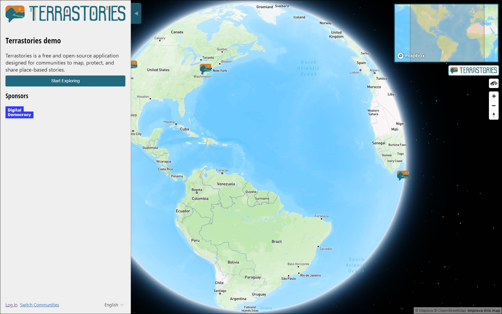
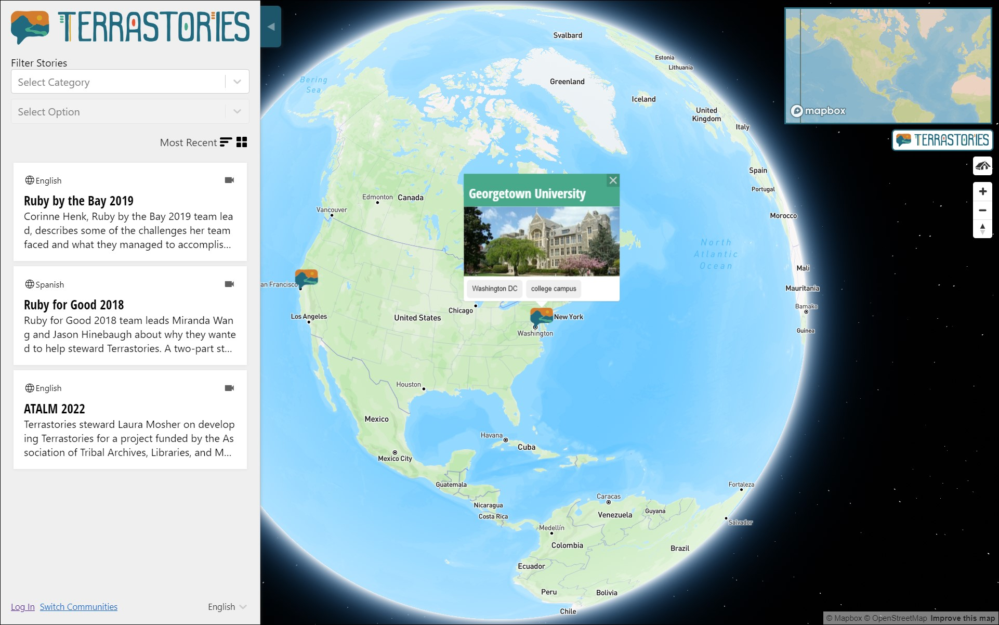
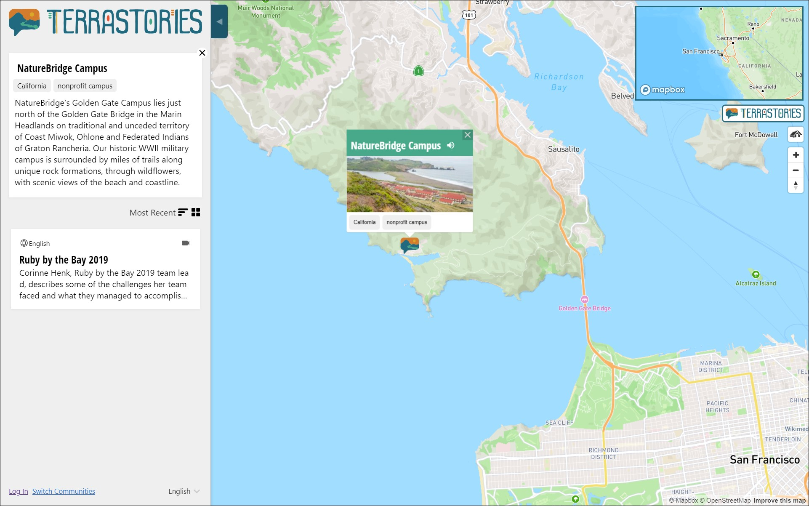
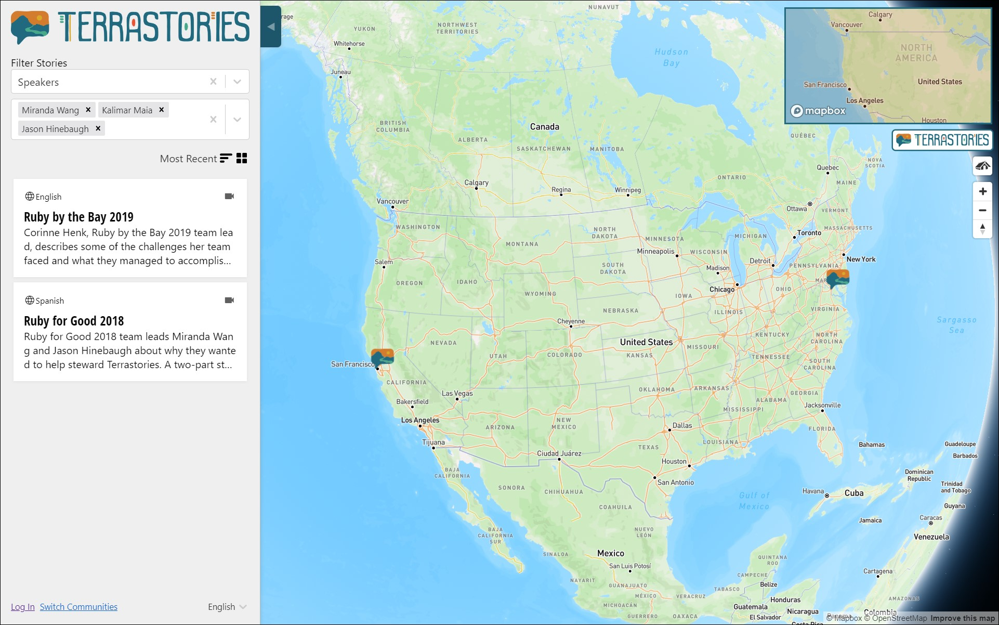
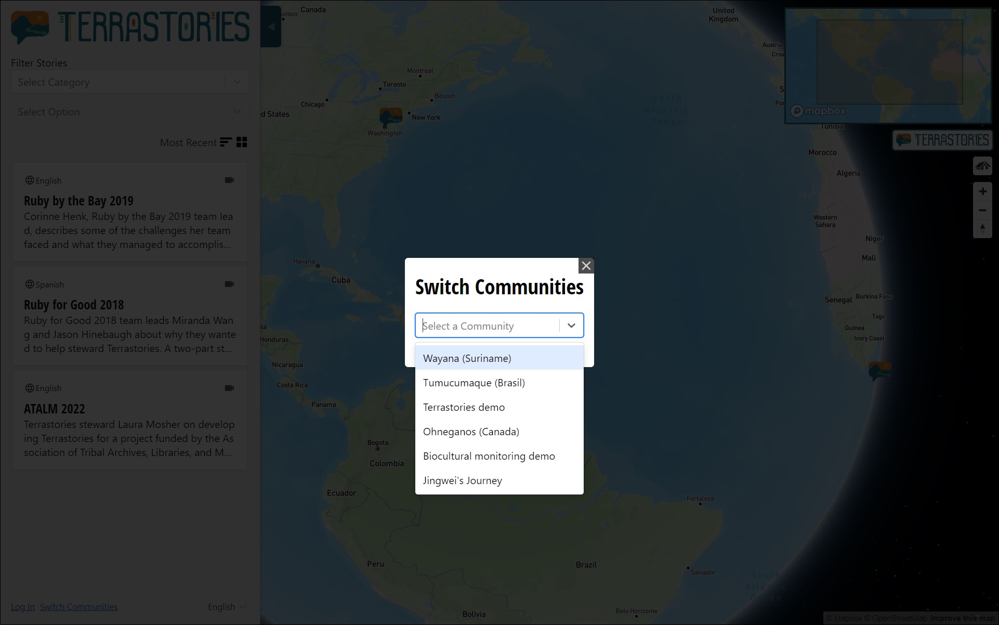

# Exploring the Explore Terrastories interface

The welcome interface for Explore Terrastories allows the user to browse and search for any community that has opted in to sharing their content with a greater public. You can either browse the list or search for the name of a community. You can also select a language on the top right of the window.

<figure><figcaption></figcaption></figure>

Once a community has been selected, you will view their map (without needing to log in!)

<figure><figcaption></figcaption></figure>


Note: Explore Terrastories shows the same default basemap for all communities. This is done in order to protect any sensitive information that may be added to a community's custom map. In the future, we will make it possible for communities to select their own custom map for their Explore Terrastories view.


&#x20;The Explore Terrastories interface offers a much streamlined and improved over what is offered in [exploring-the-terrastories-main-interface.md](../using-terrastories/exploring-the-terrastories-main-interface.md "mention"), and eventually we will adapt the main Terrastories interface to use the new framework and design of Explore Terrastories. That said, much of the functionality is the same, with a few differences:

<figure><figcaption></figcaption></figure>

The main sidebar now shows a more truncated, streamlined version of the content. Clicking on a story will open the full details of the story, with a much improved layout:

<figure><figcaption></figcaption></figure>

Information about Places now opens in the sidebar, too, giving users the ability to add more more information which previously was only shown in the popup on the map.&#x20;

<figure><figcaption></figcaption></figure>

You can also filter Places using the dropdowns:

<figure><figcaption></figcaption></figure>

It is now possible to expand the image in the Place popup on the map, to view it in a higher resolution:

<figure><figcaption></figcaption></figure>

You can add multiple results to your filter in the secondary sidebar:

<figure><figcaption></figcaption></figure>

Lastly, you can toggle between communities! Once you have selected a community in the Welcome screen, you can then switch to a different community using the "Switch Communities" link in the bottom left of the sidebar:

<figure><figcaption></figcaption></figure>
