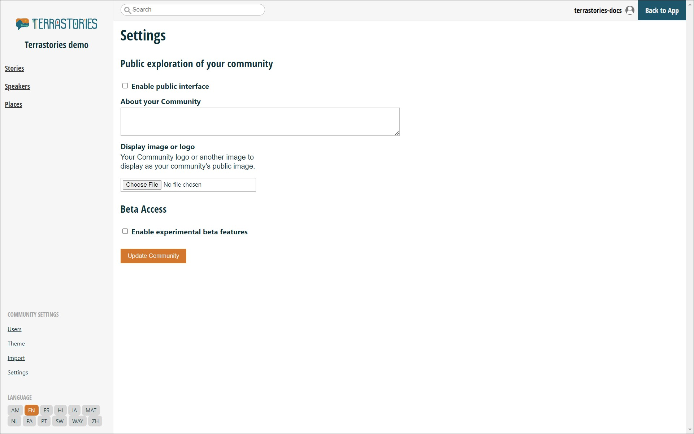

# Setting up Explore Terrastories for your community


This page is intended for communities who have an account on a Terrastories server that also has an Explore Terrastories server set up.&#x20;

For example, the [**our.terrastories.app**](https://our.terrastories.app/) server is allowing communities to opt in to using Explore Terrastories at [**explore.terrastories.app**](https://explore.terrastories.app/).


### Opting in to use, and configuring Explore Terrastories

To start using Explore Terrastories, you first have to opt in as a community `admin` to using it.

You will find settings for Explore Terrastories in the **Settings** menu for your community, under the heading "Public exploration of your community."


If you don't see any Explore Terrastories settings, then you have to ask your Terrastories server administrator to set it up for you. Information about doing so (for server administrators) can be found in [setting-up-an-explore-terrastories-server.md](../setting-up-a-terrastories-server/setting-up-an-explore-terrastories-server.md "mention"), but in the case of the [**our.terrastories.app**](https://our.terrastories.app/) server, please get in touch with Digital Democracy. Information for doing so on the [support.md](../miscellaneous/support.md "mention") page.


<figure><figcaption></figcaption></figure>

There are a few options here:

* **Enable public interface**: this check-box enables your Explore Terrastories view, which means it will show up on Explore Terrastories right away. <mark style="color:red;">**Please ensure you are ready to go public before you enable this!**</mark>
* **About your community:** this is a short description that will show up on the Welcome page of Explore Terrastories, and in the sidebar of your map when somebody first visits it.
* **Display image or logo**: you can upload an image or logo that will show at the top of the sidebar of your Explore Terrastories map.

Once you have enabled the public interface, you will be shown a direct URL for your Explore Terrrastories map that you can bookmark, embed, or share:

<figure><figcaption></figcaption></figure>


In the future, we will make it possible for you to add your own map style for your Explore Terrastories view, and other settings too.


### Selecting Stories to be show on Explore Terrastories

Explore Terrastories will show any of your community stories that have a Permission Level of `anonymous`:

<figure><figcaption></figcaption></figure>

Before you activate "Enable public interface", make sure you are sharing only the stories that you want to share by going through your Stories list, and ensuring that _anything_ that should not be shown to the public is NOT set to an `anonymous` permission level. For more information on this, please see [setting-up-users-and-roles.md](../using-terrastories/using-the-terrastories-member-dashboard/setting-up-users-and-roles.md "mention") and [exploring-and-creating-stories-speakers-and-places.md](../using-terrastories/using-the-terrastories-member-dashboard/exploring-and-creating-stories-speakers-and-places.md "mention").

One easy way to do this is by using the Stories Filter and setting Visibility to `anonymous`. That will show you only the stories that are going to be shown on Explore Terrastories, and you can edit the permission level for any of the ones you want to hide:

<figure><figcaption></figcaption></figure>
