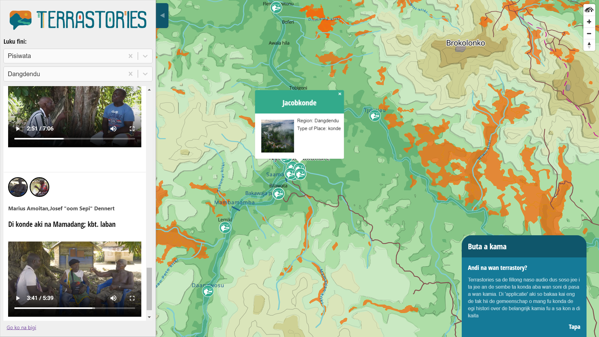

# How Terrastories is being used

**Mapping Afro-descendant ancestral oral histories in Suriname**

<figure><figcaption></figcaption></figure>

> The Matawai Maroons, a community of descendants of formerly enslaved Africans who fought for their right to exist in the rainforest over three centuries ago, are mapping their ancestral homelands along the Saramacca River in Suriname and using Terrastories to overlay place-based oral histories with their maps. [Read more](https://www.amazonteam.org/maps/lands-of-freedom/).

**Traditional knowledge of water in Canada**

<figure><figcaption></figcaption></figure>

> The Haudenosaunee people at Six Nations Reserve in Ontario, Canada are using Terrastories to map traditional ecological knowledge and Indigenous stories of the Grand River along with scientific data about water quality. [Read more](https://terrastories.io/from-the-amazon-to-the-great-lakes-sharing-knowledge-and-mapping-oral-histories-with-first-nations-communities-in-canada/).

#### Indigenous Wayana lands in Suriname

<figure><figcaption></figcaption></figure>

> The Wayana Indigenous community in Suriname is using Terrastories to map oral narrations from elders about special places and the Wayana boundary agreements with neighboring communities. [Read more](https://terrastories.app/wayana-community-in-suriname-uses-terrastories-as-part-of-their-mapping-project/).&#x20;

#### Ogiek ancestral lands along Mount Elgon in Kenya

<figure><figcaption></figcaption></figure>

> The Ogiek of Mount Elgon are using Terrastories to map stories about sacred caves, place names, and more.

#### Dakota storytelling in the United States

<figure><figcaption></figcaption></figure>

> The Dakota community of Sisseton Wahpeton Oyate is using Terrastories to map sacred stoires of the landscape.
