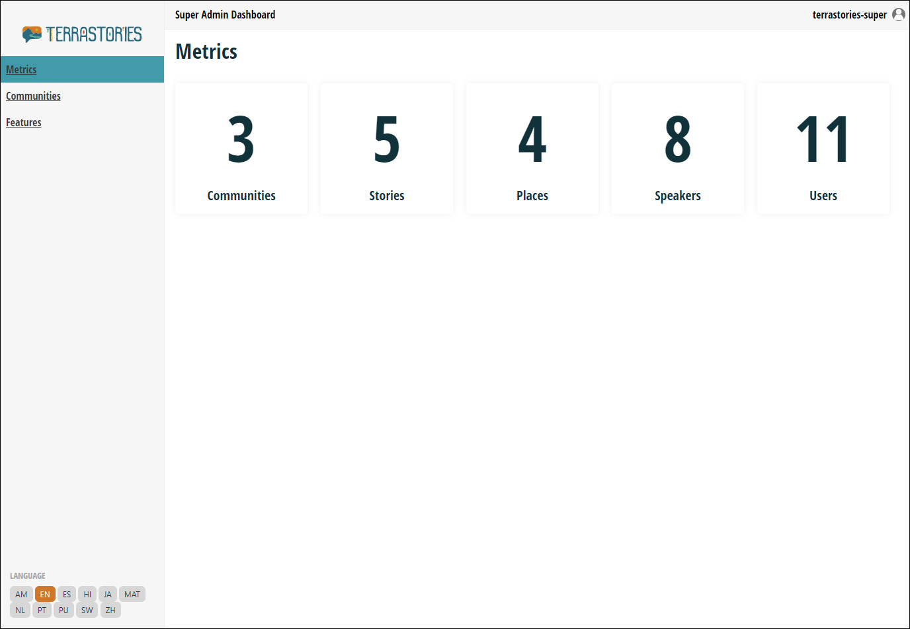

# Navigating the Super Admin dashboard

One Terrastories server can host multiple communities with their own maps and stories. The communities' data is protected and accessible only through their own user credentials.

To administer communities on Terrastories, there is a special administrative user that has the power to create and modify communities. We call this **super admin**. When logged in as super admin, you are not able to access or modify any community's data or maps; this user can only create and edit basic details of communities, as well as access generalized usage and data metrics.

### Logging in as super admin

You can log in as super admin through the same login screen as for regular community users, accessible by navigating to the main Terrastories server URL (such as [https://our.terrastories.app](https://our.terrastories.app)). If you are logged in as a community user already, you need to first log out.

<figure><figcaption></figcaption></figure>

### Super admin dashboard

Once you have logged in with a super admin credential, you will access the super admin dashboard. At this time, there are only a few dashboard views available to super admins. The two that will be discussed in this guide are **Metrics** and **Communities**.

The **metrics** dashboard provides an aggregate of all communities, stories, places, speakers, and users on the server. This can be used by the administrator of the server to keep track of, and report on, the data being provisioned by their Terrastories server.

<figure><figcaption></figcaption></figure>


The super admin can only see a total of stories, places, speakers, and users. They are _not_ able to view any individual data associated with a community. This is an important point that relates to **data sovereignty** - on a Terrastories server, even the server's super admin is not able to access any community data without permission.


### Managing and creating communities

In the **communities** view, you can access a list of all of the communities using the Terrastories server, as well as when they were _last updated_ - this means the last time any data changed on the community. There are filters available to sort the communities in alphabetical order by name, when they were first created, and when they were last updated.

<figure><figcaption></figcaption></figure>

By clicking on a community, you can access more information on the community, including individual metrics on stories, places, speakers, and users; and the usernames and their respective role (permissions) associated with them. In the future, we will make it possible for a super admin to help reset the password for a user that has lost them.&#x20;

<figure><figcaption></figcaption></figure>

### Creating a new community

From the community view, it is also possible to create a new community. The fields you can fill in are as follows:

* **Name** (required): the name of the community.
* **Country**: the country where the community is located. Currently, not being used anywhere in the Terrastories member dashboard or map.
* **Locale**: the language used by the community, by language ISO code (e.g. `en`, `es`, `pt`, `sw`, `pu`...). In the future, we may use this to set a default language for a community when logged in.
* **Username** (required): This will be an admin user of the community, used to log in to the community and to create other users, and set theme and map settings.
* **Password** (required): The password for the admin user for the community.
* **Email**: **** Email address associated with the admin user. This can be used to send emails by the Terrastories in the future, for example, for the purposes of resetting a password.

<figure><figcaption></figcaption></figure>


In addition to editing, or creating communities, the super admin can also **delete** a community. Doing so may be desirable if there is a community that was e.g. created for demo purposes and is taking up unnecessary storage space. Doing so is NOT reversible so it is advisable to carefully consider whether this is the right decision.


### Default super admin on a new Terrastories server

The default super admin credential on a new Terrastories server is `terrastories-super` with password `terrastories`. When you install Terrastories for the first time, you can log in with this username to set up the communities you will be hosting.


It is highly recommended to change the password of the super-admin username once you set up a new Terrastories server.

