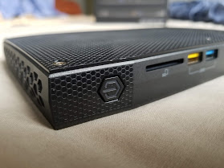

# Operating an offline Terrastories "Field Kit"


These instructions are for operating an offline Terrastories "Field Kit" device once it has been set up for you. If you need to set one up, or pass along instructions to someone with an IT background that can help you, please refer to [hosting-terrastories-offline-as-a-field-kit.md](../setting-up-a-terrastories-server/hosting-environments/hosting-terrastories-offline-as-a-field-kit.md "mention").


Terrastories works on a mini-computer, which transmits a WiFi signal that other devices can use to open the application. We call this a :hut: Terrastories "Field Kit."

This is not a “real” WiFi signal that you can use to connect to the internet. Instead, it is an offline network, using which you can open Terrastories on your own device (phone, tablet, or laptop). Multiple devices can connect to and open Terrastories at any time.

All you need to do is turn on the mini-computer, connect to the WiFi, and you can start browsing Terrastories!

## Steps to operate the Terrastories "Field Kit"

#### **STEP 1.** Plug in the power cable and connect it to the Terrastories mini-computer.

<figure><figcaption></figcaption></figure>

#### **STEP 2.** Turn on the Terrastories mini-computer by pressing the “on/off” button.&#x20;

The button will light up, indicating that the mini-computer has started.

<figure><figcaption></figcaption></figure>

#### **STEP 3.** After about 30 seconds, you can connect to the Terrastories WiFi with your device.

<figure><figcaption></figcaption></figure>

#### **STEP 4.** Open your browser and go to terrastories.local.&#x20;

It will load the welcome screen.

At this welcome screen, you can enter the site, or log in. You can also change the language of Terrastories.\
\
By logging in, you can add more stories or modify the content, or, set stories as restricted so they cannot be viewed without logging in.

<figure><figcaption>
NOTE: The URL should be terrastories.local instead of terrastories.io.
</figcaption></figure>

#### **STEP 5.** Interact with the Terrastories application :relaxed:

You can either…

Move around on the map to explore the lands, and press on points to filter the stories, or…

You can use the sidebar to access stories and filter the places associated with them.

On the mobile view, the sidebar is hidden by default. You can open it by pressing the top left arrow button.

<figure><figcaption>
NOTE: The URL should be terrastories.local instead of terrastories.io.
</figcaption></figure>

#### **STEP 6.** Turning off and storing the device.

When you are done, turn off the Terrastories mini-computer by pressing the “on/off” button. Unplug the power cable.\
\
It is recommended that you keep the Terrastories mini-computer in the box for safekeeping and preventing dust from gathering.

<figure><figcaption></figcaption></figure>
